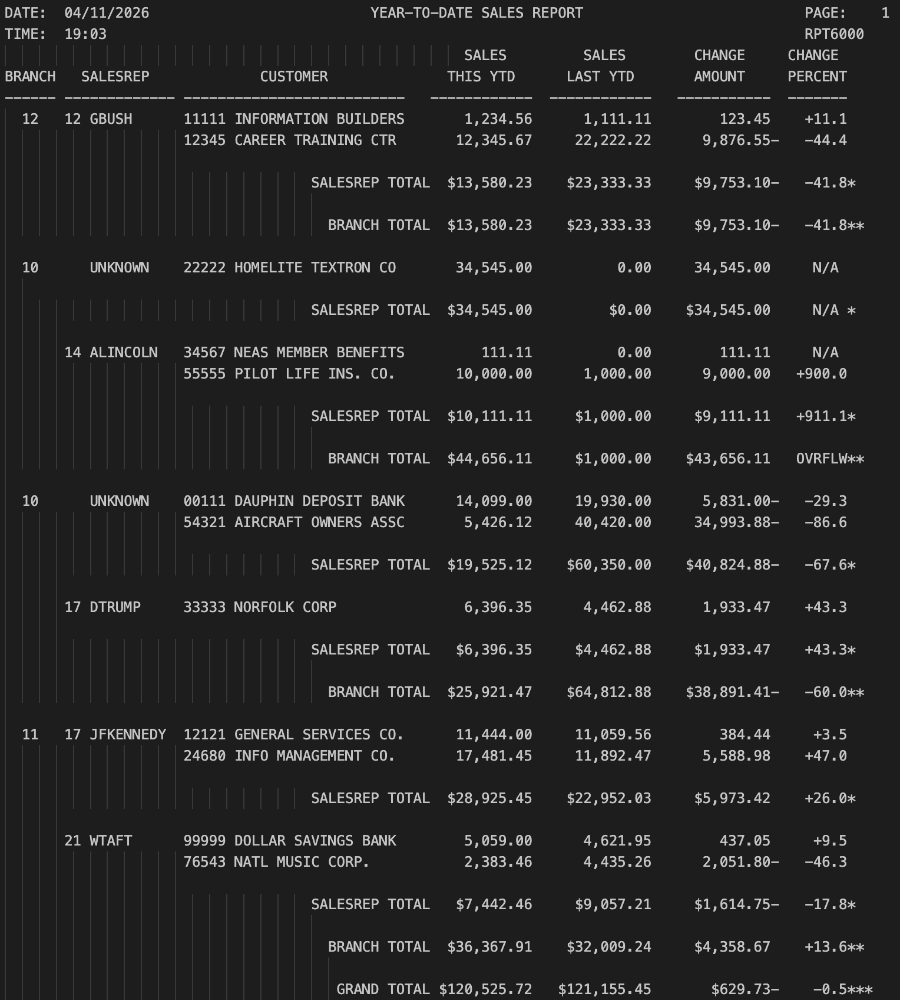

# COBOL RPT6000

## Overview
___
Chapters 6, 10, and 11 build on core COBOL skills by focusing on data formatting, table processing, and program modularization. Chapter 6
introduces advanced report formatting techniques, including edited picture clauses, the REDEFINES statement, and packed decimal fields,
allowing programs to display numeric data in a user-friendly format while also handling special cases like "N/A" and overflow conditions.
Chapter 10 expands on data handling by introducing tables with the OCCURS clause, along with indexed access and the SEARCH statement,
enabling efficient lookup of values such as SALESREP names and transitioning from hardcoded data to file-driven tables. Chapter 11
emphasizes modular design through the use of copybooks (COPYLIB), allowing developers to reuse data structures across programs and simplify
maintenance. Together, these chapters reinforce structured programming practices, improve data organization, and enhance the flexibility
and scalability of COBOL applications.

## Table of Contents
___
* [New Concepts](#new-concepts)
* [Tech Stack](#tech-stack)
* [Installation](#installation)
* [Running Output](#running-output)
* [Learning Outcomes](#learning-outcomes)
* [Help](#help)
* [Authors](#authors)

### New Concepts
___
# RPT6000 Assignment – New Concepts

This assignment introduces several new COBOL concepts from Chapters 6, 10, and 11, focusing on report formatting, table handling, file processing, and modular design.

---
## Chapter 6 – Data Formatting & Redefines

- **REDEFINES clause**
  - Allows overlaying one data item with another (e.g., numeric ↔ alphanumeric)

- **Edited picture clauses**
  - Formats numeric output using symbols like `$`, commas, decimals, and signs

- **Handling non-numeric display values**
  - Uses REDEFINES to display values such as `"N/A"` and `"OVRFLW"`

- **Packed decimal (COMP-3)**
  - Efficient storage format for numeric data, especially for calculations

- **INITIALIZE statement**
  - Resets totals and group-level data fields

- **Signed numeric formatting**
  - Displays positive and negative values with proper sign placement

---

## Chapter 10 – Tables & Indexing

- **OCCURS clause**
  - Defines tables (arrays) to store multiple entries

- **INDEXED BY**
  - Uses indexes instead of subscripts for efficient table access

- **SEARCH statement**
  - Performs sequential lookup within a table

- **AT END condition**
  - Handles cases where a value is not found (e.g., assigning `"UNKNOWN"`)

- **Table lookup logic**
  - Matches SALESREP number to retrieve the corresponding name

- **Modular paragraph design**
  - Encapsulates logic in reusable sections (e.g., `325-MOVE-SALESREP-NAME`)

- **Hardcoded vs dynamic tables**
  - Transition from fixed table values to file-loaded data

---

## File Handling for Table Loading

- **Sequential file processing**
  - Reads records one at a time from an input file

- **FILE-CONTROL and FD statements**
  - Define file structure and access

- **EOF (End-of-File) switch**
  - Controls when to stop reading a file

- **PERFORM UNTIL loop**
  - Iterates through file records until EOF is reached

- **Populating tables from files**
  - Loads table entries dynamically from file input

- **OPEN / READ / CLOSE operations**
  - Standard file handling workflow in COBOL

---

## Chapter 11 – Copybooks (COPYLIB)

- **COPY statement**
  - Reuses predefined data structures

- **COPYLIB dataset**
  - Stores reusable record layouts for multiple programs

- **Modular program design**
  - Separates data definitions from program logic

- **JCL SYSLIB usage**
  - Links COPYLIB to the COBOL compilation process

## Tech Stack
___
* 
* 
* 

## Installation
___
1. Clone the repository to your local machine. (or just steal my code)
2. Put the code into VS Code in your mainframe of choice

## Running Output
___

## Learning Outcomes
___
- Apply **REDEFINES** and edited picture clauses for report formatting  
- Handle special values like `"N/A"` and `"OVRFLW"`  
- Use **COMP-3 (packed decimal)** and `INITIALIZE` for data handling  

- Define and process **tables (OCCURS)** with indexed access  
- Perform lookups using **SEARCH** and handle missing data  

- Read and process files using **OPEN, READ, CLOSE**, and EOF logic  
- Load table data dynamically from input files  

- Use **COPY statements** and COPYLIB for modular design  
- Improve program structure, readability, and error handling  

## Help
___
* Make sure compiler is running correctly.
* Potentially re-clone repository
* restart IDE

## Authors
___

**Clay Rasmussen**
* **Clay's GitHub Profile**: [Clay-Rasmussen](https://github.com/Clay-Rasmussen)
* **Clay's Email**: [clrasm02@wsc.edu](mailto:clrasm02@wsc.edu)

[Back to the top](#overview)
